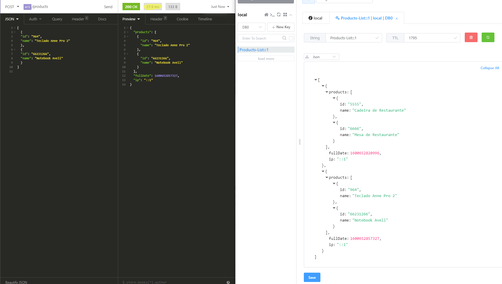
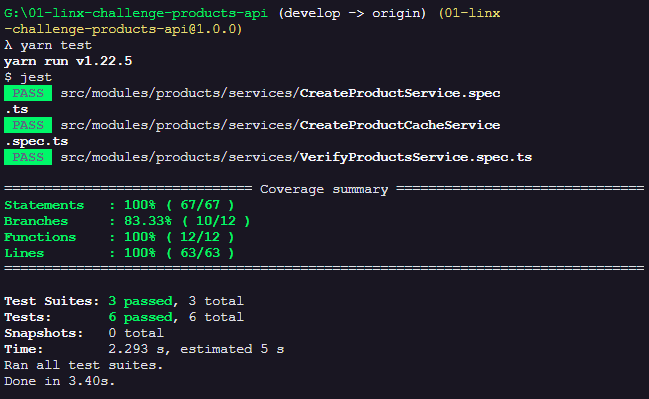
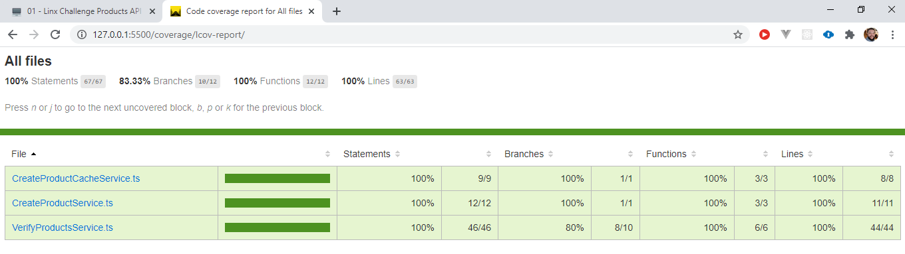
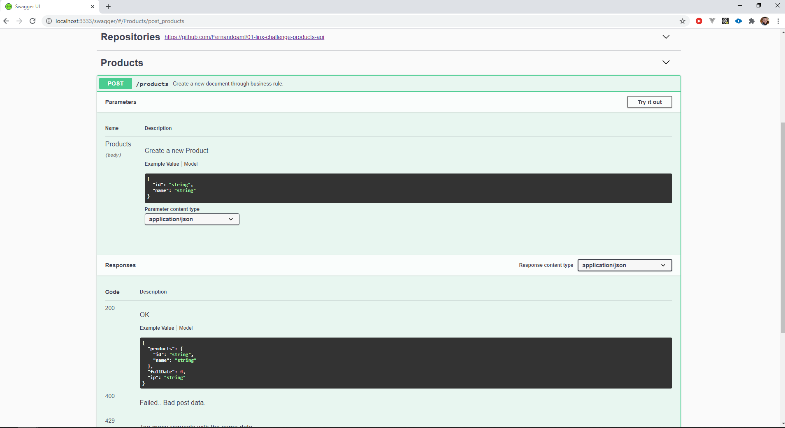

# 01 - Linx Challenge Products API

Project Link: [https://github.com/Fernandoaml/01-linx-challenge-products-api](https://github.com/Fernandoaml/01-linx-challenge-products-api)

> **\#\# Parte 1 - API de produtos**
>
> Precisamos de uma API para receber a atualização de dados cadastrais de produtos. Ela deve receber um corpo no formato JSON, onde o tamanho varia desde alguns poucos Kb até alguns Gb.
>
> Experiências anteriores mostram que alguns clientes costumam enviar o mesmo corpo repetidas vezes ao longo de um curto espaço de tempo.
>
> Isso nos causou alguns problemas, como o fato de ter que escalar nossos bancos de dados muito além do necessário afim de aguentar a carga extra desnecessária.
>
> Para evitar que isto ocorra, precisamos que esta API negue requisições que tem o mesmo corpo num intervalo de 10 minutos.
>
> Aqui está um exemplo do comportamento esperado:
>
> ```text
>
> # 2018-03-01T13:00:00 - primeira requisição, durante 10 minutos requests com o mesmo corpo serão negadas
>
> curl -XPOST http://your-api.chaordic.com.br/v1/products -d '[{"id": "123", "name": "mesa"}]' #=> 200 OK
>
> # 2018-03-01T13:09:59 - mesmo corpo que a request anterior.
>
> curl -XPOST http://your-api.chaordic.com.br/v1/products -d '[{"id": "123", "name": "mesa"}]' #=> 403 Forbidden
>
> # 2018-03-01T13:10:00 - agora a API deve voltar a aceitar o corpo
>
> curl -XPOST http://your-api.chaordic.com.br/v1/products -d '[{"id": "123", "name": "mesa"}]' #=> 200 OK
> ```
>
> Como esta API atenderá milhares de requisições simultâneas, ela precisa funcionar em um cluster.
>
> É esperado que o comportamento descrito acima se mantenha, independente do nó que receber a requisição.

## Solution:

The created API, it should be able to create a new product. The Api need verify if as receiving same data, and if the interval between of requests are greater than 10 minutes. If yes, it update the store file on redis making a fast comunication and verification on the data. If the request of data is less than 10 minutes, it's occur a throw new APP Error with the message "Too many requests to same data." and 429 code error. And If is a new data from a new ip without any data, it be save on the redis normaly. thinking on save the space of radis database, after 30 minutes witout comunication from a existin ip on database. All the data from them will be ereased automatically.



### 

#### The architecture:

* The back-end is ready to be exported to a any version of JavaScript. Was used TypeScript and React to resolve the scarcity of developers with knowledge of leged versions.
* The persistence of data are ready to grow up or be change. Today we use Redis to Cache data, but it's ready to accept any other.
* The project is ready to be scaled. applying many type of solutions to that. At choice of project.

#### S.O.L.I.D principles / DDD and TDD.

I applied the DDD \(Domain-Driven Design\), segmented through knowledge area \(module/archive\). Applied to a few concepts of S.O.L.I.D, and developed with TDD applying unity tests.

#### Libraries:

* Dotenv: Loads environment variables from .env file.
* Express: Fast, unopinionated, minimalist web framework. REST.
* Reflect-metadata: Polyfill for Metadata Reflection API.
* Tsyringe: Lightweight dependency injection container for JavaScript/TypeScript.
* class-transformer: Proper decorator-based transformation / serialization / deserialization of plain javascript objects to class constructors.
* jsonwebtoken: JSON Web Token implementation \(symmetric and asymmetric\).
* multer: Middleware for handling `multipart/form-data`.
* request-ip: A small node.js module to retrieve the request's IP address
* Redis: A robust, performance-focused and full-featured Redis client for Node.js.
* rate-limiter-flexible: library to prevent ddos.
* swagger-ui-express: Swagger UI Express

## Getting Start

1. You should be have the LTS version of the node.
   1. [https://nodejs.org/en/](https://nodejs.org/en/)
      1. Ex: 12.18.3 LTS
2. After the node js install, you should be install the yarn Package Manager
   1. **npm install -g yarn**
3. You need the docker on you computer.
   1. [https://www.docker.com/get-started](https://www.docker.com/get-started)
   2. You should run this command on command line interface with access to docker \( docker run --name redis -e ALLOW\_EMPTY\_PASSWORD=yes -p 6379:6379 -d bitnami/redis:latest \).
      1. don't need to change anything.
4. **You need clone the back end project:**
   1. [https://github.com/Fernandoaml/btg\_pactual\_back\_end.git](https://github.com/Fernandoaml/01-linx-challenge-products-api.git)
   2. Go to the folder and on command line interface you must be run this command: **yarn**
   3. You need rename the \(**.env copy**\) file to **.env** 
      1. And don't need to change anything.
5. **After run: yarn dev:server**

## **Tests:**

* **Back End:**
  * To Back end i used the JEST to make the TDD aplying unity tests
  * If you're with command line opened, you must open a new interface of command line in the same folder and run the next command.
    * **yarn test**



*  **To see the coverage report \(Lcov-report\) you need to open the following file**:
  * \01-linx-challenge-products-api\coverage\lcov-report\index.html



## API - Swagger UI

* after of initialization of back-end. You will can access the Swagger page, to see the description of the API REST of LabQuality. The page as exemplification, as shown in the image below.
  * [http://localhost:3333/swagger/](http://localhost:3333/swagger/)



